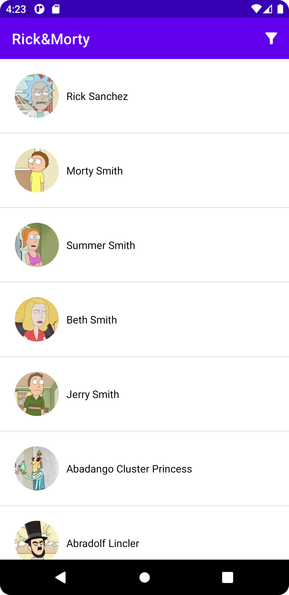

This repository contains Android application based in https://rickandmortyapi.com/.

 

## User Stories

1. The first thing a user should see is a list of characters.
2. If the user taps into an character the app has to display some details of this character

## Functionality

The app is composed of 2 main screens:

### Characters List

It allows you to list characters in pages. Network results are kept in the database in the `characters` table. Each time a new page is fetched, the same `character` record in the database is updated with the new data.

### Character Details

This screen displays the details of a character

## Technical details

The Application implemented and structured based on the **MVVM** pattern.

The **Data** layer contains **Network Client** implemented by *Retrofit* library to get access to remote data on [Rick And Morty API](https://rickandmortyapi.com/) and **DB** implemented by *Room* library to cache and persist those data locally in case of offline usage.

The **View** layer is done with the [Android Navigation Component](https://developer.android.com/guide/navigation) including one MainActivity which holds the navigation host fragment.

The **Koin** library does the *dependency injections* in the whole app.

## Libraries

- **Glide** image downloading and caching library made by [bumptech](https://github.com/bumptech/glide)
- **Retrofit** and **OkHttp** API libraries made by [square](https://github.com/square/retrofit)
- **Kotlin Serialization** plugin made by [jetbrains](https://github.com/Kotlin/kotlinx.serialization)
- **Koin** dependency injector library made by [InsertKoinIO](https://github.com/InsertKoinIO/koin)

## License

Copyright 2022 Alexander de Oliveira

Licensed to the Apache Software Foundation (ASF) under one or more contributor license agreements. See the NOTICE file distributed with this work for additional information regarding copyright ownership. The ASF licenses this file to you under the Apache License, Version 2.0 (the "License"); you may not use this file except in compliance with the License. You may obtain a copy of the License at

http://www.apache.org/licenses/LICENSE-2.0